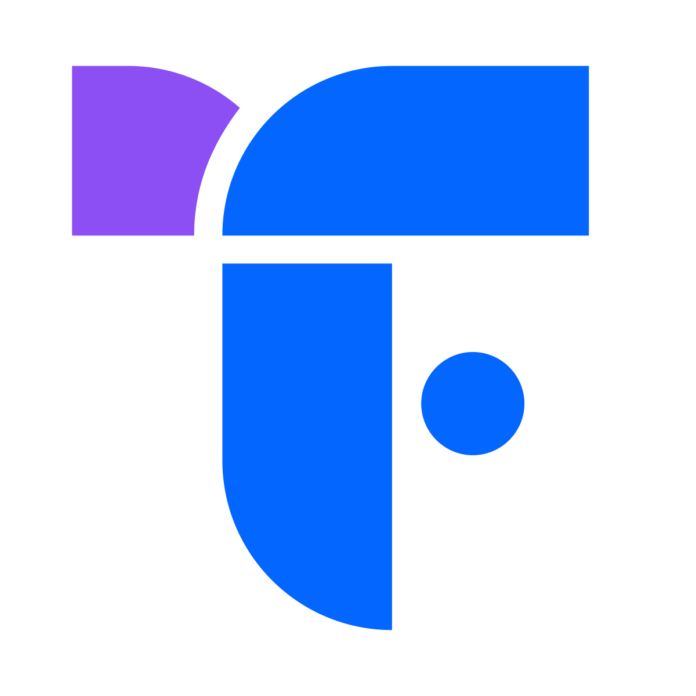

<!-- _class: dark -->

  
  FlairsTech

  

    
  

  

    
Internal Commercial Model

    <h1>From managed services to AI-enabled operating models.</h1>
    
This model turns AI from a loose capability into a priced commercial structure across CX and BDR.

  

  

    <strong>35–40%</strong>
    Baseline margin target
  

  

    <strong>+25%</strong>
    AI-Enabled CX target uplift
  

  

    <strong>+30%</strong>
    AIMY-Powered BDR target uplift
  

  

    <strong>40–65%</strong>
    AI-first entry margin target
  

  AI Commercial Model Strategy
  01

---

  
  FlairsTech

Commercial Strategy

<h2>The Strategic Story</h2>

AI does not replace the service model. It changes how the service is packaged, priced, and governed.

  

    <h3>1 Protect the base</h3>
    
Legacy Managed CX and Managed BDR remain available for capacity-led clients and lower AI-maturity accounts.

    
<strong>FTE/month pricing</strong> 35–40% baseline margin Useful fallback, not default

  

  
  

    <h3>2 Upgrade the core</h3>
    
AI-Enabled CX and AIMY-Powered BDR add a priced operating layer across QA, coaching, visibility, and governance.

    
<strong>CX uplift target: +25%</strong> <strong>BDR uplift target: +30%</strong> Measured through ROI & usage

  

  
  

    <h3>3 Open new doors</h3>
    
AI-first entry products give Sales a low-friction way to prove value before a full outsourcing pitch.

    
<strong>Fixed project / Pilot fees</strong> AI QA Pilot & Diagnostics ICP/List Build & BDR QA

  

  AI Commercial Model Strategy
  02

---

  
  FlairsTech

Commercial Strategy

<h2>Portfolio Architecture</h2>

Three commercial routes across two service lines. The model is intentionally not one generic “AI strategy.”

<table>
  <colgroup>
    <col style="width: 15%;">
    <col style="width: 25%;">
    <col style="width: 25%;">
    <col style="width: 15%;">
    <col style="width: 20%;">
  </colgroup>
  <thead>
    <tr>
      <th>Route</th>
      <th>CX offer</th>
      <th>BDR offer</th>
      <th>Pricing logic</th>
      <th>Margin role</th>
    </tr>
  </thead>
  <tbody>
    <tr>
      <td><strong>Legacy Managed</strong></td>
      <td>Managed CX</td>
      <td>Managed BDR</td>
      <td>FTE/month</td>
      <td>Protect current base business at 35–40%</td>
    </tr>
    <tr>
      <td><strong>Legacy + AI</strong></td>
      <td>AI-Enabled CX</td>
      <td>AIMY-Powered BDR</td>
      <td>FTE + uplift + setup + capped usage</td>
      <td>Premium managed service and modest margin expansion</td>
    </tr>
    <tr>
      <td><strong>AI First Entry</strong></td>
      <td>AI QA Pilot, Workflow Diagnostic, Knowledge Assessment</td>
      <td>ICP/List Build, Campaign Readiness, BDR QA Pilot</td>
      <td>Fixed project / per unit / pilot</td>
      <td>Door opener and higher-margin add-on revenue</td>
    </tr>
    <tr>
      <td><strong>Expansion</strong></td>
      <td>CX Workflow Automation</td>
      <td>AIMY Growth Engine</td>
      <td>Setup + monthly / usage / hybrid outcome pricing</td>
      <td>Higher margin upside through non-FTE meters</td>
    </tr>
  </tbody>
</table>

  AI Commercial Model Strategy
  03

---

  
  FlairsTech

Financial Model

<h2>Pricing Thesis &amp; Recurring Margin</h2>

The AI uplift funds a real operating layer. True margin expansion comes from scoped modules and outcome models.

  

    <small>CX Baseline Rate</small>
    <b>$1,600</b>
  

  

    <small>AI-Enabled CX (+25%)</small>
    <b>$2,000</b>
  

  

    <small>BDR Baseline Rate</small>
    <b>$2,000</b>
  

  

    <small>AIMY-Powered BDR (+30%)</small>
    <b>$2,600</b>
  

  

    <h3>CX Recurring Margin (English L1)</h3>
    <table>
      <colgroup>
        <col style="width: 46%;">
        <col style="width: 27%;">
        <col style="width: 27%;">
      </colgroup>
      <thead>
        <tr>
          <th>Item</th>
          <th>Legacy CX</th>
          <th>AI-Enabled CX</th>
        </tr>
      </thead>
      <tbody>
        <tr>
          <td>Monthly price</td>
          <td>$1,600</td>
          <td><strong>$2,000</strong></td>
        </tr>
        <tr>
          <td>Base delivery cost</td>
          <td>$1,000</td>
          <td>$1,000</td>
        </tr>
        <tr>
          <td>AI operating cost</td>
          <td>—</td>
          <td>$175</td>
        </tr>
        <tr class="highlight-row">
          <td>Gross profit</td>
          <td>$600</td>
          <td><strong>$825</strong></td>
        </tr>
        <tr class="highlight-row">
          <td>Gross margin</td>
          <td>37.5%</td>
          <td><strong>41.3%</strong></td>
        </tr>
      </tbody>
    </table>
  

  

    <h3>BDR Recurring Margin (Standard BDR)</h3>
    <table>
      <colgroup>
        <col style="width: 46%;">
        <col style="width: 27%;">
        <col style="width: 27%;">
      </colgroup>
      <thead>
        <tr>
          <th>Item</th>
          <th>Legacy BDR</th>
          <th>AIMY-Powered BDR</th>
        </tr>
      </thead>
      <tbody>
        <tr>
          <td>Monthly price</td>
          <td>$2,000</td>
          <td><strong>$2,600</strong></td>
        </tr>
        <tr>
          <td>Base delivery cost</td>
          <td>$1,250</td>
          <td>$1,250</td>
        </tr>
        <tr>
          <td>AIMY/data/tooling cost</td>
          <td>—</td>
          <td>$300</td>
        </tr>
        <tr class="highlight-row">
          <td>Gross profit</td>
          <td>$750</td>
          <td><strong>$1,050</strong></td>
        </tr>
        <tr class="highlight-row">
          <td>Gross margin</td>
          <td>37.5%</td>
          <td><strong>40.4%</strong></td>
        </tr>
      </tbody>
    </table>
  

  AI Commercial Model Strategy
  04

---

  
  FlairsTech

Service Offering

<h2>AI-Enabled CX Offering</h2>

AI improves quality, speed, and visibility. Workflow automation and Voice AI are separate expansion layers.

  

    <h3>CX Managed</h3>
    
Standard delivery for capacity-led opportunities and lower AI-maturity clients.

    
<strong>From $1.4K–$1.7K</strong> per English L0–L1 FTE Includes Agents, TL, QA, standard training & reporting

  

  
  

    <h3>AI-Enabled CX</h3>
    
Managed CX with AI QA, Agent Assist, automatic summaries, Client Pulse, and coaching insights.

    
<strong>Target +25% uplift</strong> on applicable base rate Usage caps & overage rules apply

  

  
  

    <h3>+ CX Expansion</h3>
    
Automation, Voice AI, and diagnostics are priced separately where the workflow justifies it.

    
<strong>Typical $10K+ setup</strong> Workflow Diagnostic Voice AI priced per minute

  

  AI Commercial Model Strategy
  05

---

  
  FlairsTech

Service Offering

<h2>AIMY-Powered BDR Offering</h2>

BDR has stronger productization potential. The AIMY package needs caps on lead volume and QA coverage.

  

    <h3>Managed BDR</h3>
    
Standard BDR capacity for clients that already own the sales motion and mainly need outreach execution.

    
<strong>From $1.8K–$2.2K</strong> per BDR / month Outreach execution, manager oversight, standard reports

  

  
  

    <h3>AIMY-Powered BDR</h3>
    
Managed outbound with AI-supported sourcing, hygiene, guidance, BDR QA, Client Pulse, and CRM handoff.

    
<strong>Target +30% uplift</strong> on applicable base rate Lead sourcing/hygiene within caps

  

  
  

    <h3>AIMY Growth Engine</h3>
    
Premium model for mature campaigns where accepted meetings or SQL outcomes can be clearly defined.

    
<strong>Hybrid Pricing</strong> Base rate + meeting/SQL fee Requires clear ICP & rules

  

  AI Commercial Model Strategy
  06

---

  
  FlairsTech

Financial Model

<h2>Bundled vs Standalone Module Allocations</h2>

Bundled modules share the managed service infrastructure. The package only works if total cost stays inside the uplift.

  

    <h3>CX Bundled Module Allocation</h3>
    <table>
      <colgroup>
        <col style="width: 38%;">
        <col style="width: 22%;">
        <col style="width: 20%;">
        <col style="width: 20%;">
      </colgroup>
      <thead>
        <tr>
          <th>Module</th>
          <th>Standalone</th>
          <th>Bundled</th>
          <th>Cost</th>
        </tr>
      </thead>
      <tbody>
        <tr>
          <td>AI QA & Coaching</td>
          <td>$150/FTE</td>
          <td><strong>$85/FTE</strong></td>
          <td>$35–$60</td>
        </tr>
        <tr>
          <td>Agent Assist Copilot</td>
          <td>$125/FTE</td>
          <td><strong>$75/FTE</strong></td>
          <td>$35–$60</td>
        </tr>
        <tr>
          <td>Case Summaries</td>
          <td>$50/FTE</td>
          <td><strong>$25/FTE</strong></td>
          <td>$10–$20</td>
        </tr>
        <tr>
          <td>Client Pulse</td>
          <td>Bundled</td>
          <td><strong>$25/FTE eq.</strong></td>
          <td>$10–$20</td>
        </tr>
        <tr>
          <td>Governance / Insights</td>
          <td>$50–$100</td>
          <td><strong>$35/FTE</strong></td>
          <td>$20–$35</td>
        </tr>
        <tr class="highlight-row">
          <td>Total</td>
          <td>—</td>
          <td><strong>$245/FTE</strong></td>
          <td class="green">$110–$195</td>
        </tr>
      </tbody>
    </table>
  

  

    <h3>BDR Bundled Module Allocation</h3>
    <table>
      <colgroup>
        <col style="width: 38%;">
        <col style="width: 22%;">
        <col style="width: 20%;">
        <col style="width: 20%;">
      </colgroup>
      <thead>
        <tr>
          <th>Module</th>
          <th>Standalone</th>
          <th>Bundled</th>
          <th>Cost</th>
        </tr>
      </thead>
      <tbody>
        <tr>
          <td>Lead Sourcing + Hygiene</td>
          <td>$2k–$10k</td>
          <td><strong>$150/BDR</strong></td>
          <td>$80–$150</td>
        </tr>
        <tr>
          <td>Sales Guidance</td>
          <td>$2k–$7k</td>
          <td><strong>$75/BDR</strong></td>
          <td>$25–$50</td>
        </tr>
        <tr>
          <td>BDR QA & Coaching</td>
          <td>$200/BDR</td>
          <td><strong>$110/BDR</strong></td>
          <td>$50–$90</td>
        </tr>
        <tr>
          <td>Client Pulse</td>
          <td>Bundled</td>
          <td><strong>$50/BDR eq.</strong></td>
          <td>$20–$40</td>
        </tr>
        <tr>
          <td>Funnel Gov + Handoff</td>
          <td>$100–$200</td>
          <td><strong>$90/BDR</strong></td>
          <td>$50–$80</td>
        </tr>
        <tr class="highlight-row">
          <td>Total</td>
          <td>—</td>
          <td><strong>$475/BDR</strong></td>
          <td class="green">$225–$410</td>
        </tr>
      </tbody>
    </table>
  

  AI Commercial Model Strategy
  07

---

  
  FlairsTech

Commercial Model

<h2>CX Legacy Level Card by Language</h2>

Standard CX pricing starts from the English card. L5 remains unscaled as an operations/governance role.

<table>
  <colgroup>
    <col style="width: 16%;">
    <col style="width: 21%;">
    <col style="width: 21%;">
    <col style="width: 21%;">
    <col style="width: 21%;">
  </colgroup>
  <thead>
    <tr>
      <th>Level</th>
      <th>English</th>
      <th>French</th>
      <th>Spanish / Italian</th>
      <th>German / Dutch</th>
    </tr>
  </thead>
  <tbody>
    <tr>
      <td><strong>L0</strong></td>
      <td>$1,400–$1,600</td>
      <td>$1,575–$1,800</td>
      <td>$1,750–$2,000</td>
      <td>$1,925–$2,200</td>
    </tr>
    <tr>
      <td><strong>L1</strong></td>
      <td>$1,600–$1,700</td>
      <td>$1,800–$1,913</td>
      <td>$2,000–$2,125</td>
      <td>$2,200–$2,338</td>
    </tr>
    <tr>
      <td><strong>L2</strong></td>
      <td>$1,800–$2,000</td>
      <td>$2,025–$2,250</td>
      <td>$2,250–$2,500</td>
      <td>$2,475–$2,750</td>
    </tr>
    <tr>
      <td><strong>L3</strong></td>
      <td>$2,300–$2,500</td>
      <td>$2,588–$2,813</td>
      <td>$2,875–$3,125</td>
      <td>$3,163–$3,438</td>
    </tr>
    <tr>
      <td><strong>L4</strong></td>
      <td>$2,500–$2,800</td>
      <td>$2,813–$3,150</td>
      <td>$3,125–$3,500</td>
      <td>$3,438–$3,850</td>
    </tr>
    <tr class="highlight-row">
      <td><strong>L5 (Ops Mgr)</strong></td>
      <td>$3,000–$4,000</td>
      <td>$3,000–$4,000</td>
      <td>$3,000–$4,000</td>
      <td>$3,000–$4,000</td>
    </tr>
  </tbody>
</table>

  AI Commercial Model Strategy
  08

---

  
  FlairsTech

Commercial Model

<h2>CX AI-Enabled Level Card (+25% Uplift)</h2>

+25% applied to applicable legacy rate. Usage caps and overage rules required.

<table>
  <colgroup>
    <col style="width: 16%;">
    <col style="width: 21%;">
    <col style="width: 21%;">
    <col style="width: 21%;">
    <col style="width: 21%;">
  </colgroup>
  <thead>
    <tr>
      <th>Level</th>
      <th>English</th>
      <th>French</th>
      <th>Spanish / Italian</th>
      <th>German / Dutch</th>
    </tr>
  </thead>
  <tbody>
    <tr>
      <td><strong>L0</strong></td>
      <td>$1,750–$2,000</td>
      <td>$1,969–$2,250</td>
      <td>$2,188–$2,500</td>
      <td>$2,406–$2,750</td>
    </tr>
    <tr>
      <td><strong>L1</strong></td>
      <td>$2,000–$2,125</td>
      <td>$2,250–$2,391</td>
      <td>$2,500–$2,656</td>
      <td>$2,750–$2,922</td>
    </tr>
    <tr>
      <td><strong>L2</strong></td>
      <td>$2,250–$2,500</td>
      <td>$2,531–$2,813</td>
      <td>$2,813–$3,125</td>
      <td>$3,094–$3,438</td>
    </tr>
    <tr>
      <td><strong>L3</strong></td>
      <td>$2,875–$3,125</td>
      <td>$3,234–$3,516</td>
      <td>$3,594–$3,906</td>
      <td>$3,953–$4,297</td>
    </tr>
    <tr>
      <td><strong>L4</strong></td>
      <td>$3,125–$3,500</td>
      <td>$3,516–$3,938</td>
      <td>$3,906–$4,375</td>
      <td>$4,297–$4,813</td>
    </tr>
    <tr class="highlight-row">
      <td><strong>L5 (Ops Mgr)</strong></td>
      <td>$3,750–$5,000</td>
      <td>$3,750–$5,000</td>
      <td>$3,750–$5,000</td>
      <td>$3,750–$5,000</td>
    </tr>
  </tbody>
</table>

  AI Commercial Model Strategy
  09

---

  
  FlairsTech

Commercial Model

<h2>CX Criteria &amp; BDR Level Card (+30% Uplift)</h2>

How we classify CX work levels, alongside BDR legacy and AIMY-powered level cards.

  

    <h3>CX Criteria</h3>
    <table>
      <colgroup>
        <col style="width: 12%;">
        <col style="width: 88%;">
      </colgroup>
      <thead>
        <tr>
          <th>Lvl</th>
          <th>CX Criteria</th>
        </tr>
      </thead>
      <tbody>
        <tr>
          <td><b>L0</b></td>
          <td>Basic back office, tagging, simple updates, low judgment</td>
        </tr>
        <tr>
          <td><b>L1</b></td>
          <td>Standard customer handling with clear SOPs and escalation</td>
        </tr>
        <tr>
          <td><b>L2</b></td>
          <td>Senior handling, exceptions, refunds, complaints, multi-system</td>
        </tr>
        <tr>
          <td><b>L3</b></td>
          <td>QA, SME, training, calibration, knowledge maintenance</td>
        </tr>
        <tr>
          <td><b>L4</b></td>
          <td>Team lead / supervisor, coaching, queue & escalation control</td>
        </tr>
        <tr>
          <td><b>L5</b></td>
          <td>Ops manager, account governance, AI adoption roadmap</td>
        </tr>
      </tbody>
    </table>
  

  

    <h3>BDR Level Card</h3>
    <table>
      <colgroup>
        <col style="width: 10%;">
        <col style="width: 42%;">
        <col style="width: 24%;">
        <col style="width: 24%;">
      </colgroup>
      <thead>
        <tr>
          <th>Lvl</th>
          <th>Function</th>
          <th>Legacy</th>
          <th>AIMY +30%</th>
        </tr>
      </thead>
      <tbody>
        <tr>
          <td><b>L0</b></td>
          <td>Research / Hygiene</td>
          <td>$1.3K–$1.8K</td>
          <td><strong>$1.7K–$2.3K</strong></td>
        </tr>
        <tr>
          <td><b>L1</b></td>
          <td>Standard BDR</td>
          <td>$1.8K–$2.2K</td>
          <td><strong>$2.3K–$2.9K</strong></td>
        </tr>
        <tr>
          <td><b>L2</b></td>
          <td>Senior / Multilingual</td>
          <td>$2.2K–$2.8K</td>
          <td><strong>$2.9K–$3.6K</strong></td>
        </tr>
        <tr>
          <td><b>L3</b></td>
          <td>BDR TL / QA</td>
          <td>$3.0K–$3.8K</td>
          <td><strong>$3.9K–$4.9K</strong></td>
        </tr>
        <tr>
          <td><b>L4</b></td>
          <td>BDR Manager</td>
          <td>$4.0K–$5.0K</td>
          <td><strong>$5.2K–$6.5K</strong></td>
        </tr>
        <tr>
          <td><b>L5</b></td>
          <td>AIMY Growth Cons.</td>
          <td>$5.0K–$7.0K</td>
          <td><strong>$6.5K–$9.1K</strong></td>
        </tr>
      </tbody>
    </table>
  

  AI Commercial Model Strategy
  10

---

  
  FlairsTech

Value Proposition

<h2>Client ROI &amp; Value Cases</h2>

The premium must be justified through measurable operating value. ROI reviewed after 90 days.

  

    <h3>CX Value Case (20-FTE, +$8k/mo premium)</h3>
    <table>
      <colgroup>
        <col style="width: 72%;">
        <col style="width: 28%;">
      </colgroup>
      <thead>
        <tr>
          <th>Metric</th>
          <th>Target range</th>
        </tr>
      </thead>
      <tbody>
        <tr>
          <td>Productivity / capacity</td>
          <td class="green">10–15%</td>
        </tr>
        <tr>
          <td>AHT reduction</td>
          <td class="green">8–15%</td>
        </tr>
        <tr>
          <td>Wrap-up reduction</td>
          <td class="green">15–30%</td>
        </tr>
        <tr>
          <td>QA coverage expansion</td>
          <td class="green">5–10x</td>
        </tr>
        <tr>
          <td>Rework / recontact reduction</td>
          <td class="green">5–10%</td>
        </tr>
        <tr>
          <td>Ramp improvement</td>
          <td class="green">10–20%</td>
        </tr>
      </tbody>
    </table>
  

  

    <h3>BDR Value Case (5-BDR, +$3k/mo premium)</h3>
    <table>
      <colgroup>
        <col style="width: 72%;">
        <col style="width: 28%;">
      </colgroup>
      <thead>
        <tr>
          <th>Metric</th>
          <th>Target range</th>
        </tr>
      </thead>
      <tbody>
        <tr>
          <td>Bad-fit lead waste reduction</td>
          <td class="green">10–20%</td>
        </tr>
        <tr>
          <td>Lead coverage improvement</td>
          <td class="green">10–15%</td>
        </tr>
        <tr>
          <td>Engagement relative uplift</td>
          <td class="green">5–10%</td>
        </tr>
        <tr>
          <td>Accepted meeting quality uplift</td>
          <td class="green">5–10%</td>
        </tr>
        <tr>
          <td>BDR ramp/coaching improvement</td>
          <td class="green">10–20%</td>
        </tr>
        <tr>
          <td>Handoff leakage reduction</td>
          <td class="green">5–10%</td>
        </tr>
      </tbody>
    </table>
  

  AI Commercial Model Strategy
  11

---

  
  FlairsTech

Governance

<h2>Governance &amp; Implementation Timeline</h2>

Implementation process turns the commercial model into a controlled operating system.

  

    <h3>01 Baseline &amp; Scope</h3>
    
<strong>Weeks 1–2</strong>

    
Confirm workflows, data access, KPIs, scope, and commercial assumptions with the client.

  

  
  

    <h3>02 Configure &amp; Build</h3>
    
<strong>Weeks 3–5</strong>

    
Configure AI QA, agent assist/guidance, Client Pulse dashboards, and the governance model.

  

  
  

    <h3>03 Pilot &amp; Calibrate</h3>
    
<strong>Weeks 6–8</strong>

    
Run controlled pilot, compare AI output with human review, and adjust model parameters.

  

  
  

    <h3>04 Scale &amp; Govern</h3>
    
<strong>Weeks 9–12</strong>

    
Expand coverage, move into recurring monthly operating reviews, and audit metrics.

  

  AI Commercial Model Strategy
  12

---

  
  FlairsTech

Governance

<h2>Guardrails &amp; Eligibility Rules</h2>

Pricing only works when scope, usage, and delivery ownership are controlled and protected.

  

    <h3>Commercial Guardrails</h3>
    <table>
      <colgroup>
        <col style="width: 33%;">
        <col style="width: 67%;">
      </colgroup>
      <thead>
        <tr>
          <th>Rule</th>
          <th>Recommendation</th>
        </tr>
      </thead>
      <tbody>
        <tr>
          <td><b>Minimum term</b></td>
          <td>6 months, 12 months preferred when setup is amortized</td>
        </tr>
        <tr>
          <td><b>Setup fee</b></td>
          <td>mandatory unless explicitly amortized</td>
        </tr>
        <tr>
          <td><b>Usage caps</b></td>
          <td>required for AI QA, transcription, lead sourcing, dashboards, integrations</td>
        </tr>
        <tr>
          <td><b>Change requests</b></td>
          <td>required for new workflows, channels, languages, ICPs, dashboards</td>
        </tr>
        <tr>
          <td><b>Repricing</b></td>
          <td>volume, channel mix, scope, QA coverage, or data needs change materially</td>
        </tr>
      </tbody>
    </table>
  

  

    <h3>Package Eligibility</h3>
    <table>
      <colgroup>
        <col style="width: 30%;">
        <col style="width: 35%;">
        <col style="width: 35%;">
      </colgroup>
      <thead>
        <tr>
          <th>Package</th>
          <th>Good fit</th>
          <th>Avoid when</th>
        </tr>
      </thead>
      <tbody>
        <tr>
          <td><b>Managed CX/BDR</b></td>
          <td>capacity need, low AI maturity</td>
          <td>client expects transformation or outcome pricing</td>
        </tr>
        <tr>
          <td><b>AI-Enabled CX</b></td>
          <td>stable workflows, KB, data access</td>
          <td>broken SOPs, no baseline, unclear ownership</td>
        </tr>
        <tr>
          <td><b>AIMY-Powered BDR</b></td>
          <td>clear ICP, lead source, handoff rules</td>
          <td>vague ICP, weak offer, no sales owner</td>
        </tr>
        <tr>
          <td><b>Automation/Growth</b></td>
          <td>clear process and outcomes</td>
          <td>subjective criteria, high uncertainty</td>
        </tr>
      </tbody>
    </table>
  

  AI Commercial Model Strategy
  13

---

  
  FlairsTech

Sales Enablement

<h2>Entry Signal to Expansion Path</h2>

Sales should use AI-first products to diagnose and prove value, then convert into premium operating models.

<table>
  <colgroup>
    <col style="width: 30%;">
    <col style="width: 25%;">
    <col style="width: 45%;">
  </colgroup>
  <thead>
    <tr>
      <th>Client Signal</th>
      <th>Entry Offer</th>
      <th>Expansion Path</th>
    </tr>
  </thead>
  <tbody>
    <tr>
      <td>Weak QA visibility</td>
      <td><strong>AI QA Pilot</strong></td>
      <td>AI QA managed service → AI-Enabled CX</td>
    </tr>
    <tr>
      <td>Manual / repetitive workflow</td>
      <td><strong>Workflow Diagnostic</strong></td>
      <td>CX Workflow Automation</td>
    </tr>
    <tr>
      <td>Poor knowledge consistency</td>
      <td><strong>Knowledge Assessment</strong></td>
      <td>Agent Assist → AI-Enabled CX</td>
    </tr>
    <tr>
      <td>Poor lead quality</td>
      <td><strong>ICP/List Build</strong></td>
      <td>AIMY-Powered BDR</td>
    </tr>
    <tr>
      <td>Weak outbound messaging</td>
      <td><strong>Campaign Readiness Pack</strong></td>
      <td>AIMY-Powered BDR</td>
    </tr>
    <tr>
      <td>BDR activity but low quality</td>
      <td><strong>BDR QA Pilot</strong></td>
      <td>AIMY-Powered BDR / Growth Engine</td>
    </tr>
    <tr>
      <td>Clear ICP + outcome focus</td>
      <td><strong>AIMY Growth Engine</strong></td>
      <td>Hybrid pricing / expanded campaigns</td>
    </tr>
  </tbody>
</table>

  AI Commercial Model Strategy
  14

---

  
  FlairsTech

Sales Enablement

<h2>Recommended Leadership Decisions</h2>

Decisions required by management to make the commercial model executable in production.

<table>
  <colgroup>
    <col style="width: 32%;">
    <col style="width: 68%;">
  </colgroup>
  <thead>
    <tr>
      <th>Decision</th>
      <th>Recommended Default</th>
    </tr>
  </thead>
  <tbody>
    <tr>
      <td><strong>CX AI uplift</strong></td>
      <td>+25% target applied to base rate card</td>
    </tr>
    <tr>
      <td><strong>BDR AIMY uplift</strong></td>
      <td>+30% target applied to base rate card</td>
    </tr>
    <tr>
      <td><strong>Setup fee policy</strong></td>
      <td>mandatory unless amortized into a longer-term contract</td>
    </tr>
    <tr>
      <td><strong>Client Pulse</strong></td>
      <td>bundled visibility only, not standalone software access</td>
    </tr>
    <tr>
      <td><strong>AI First</strong></td>
      <td>shortlist 3 CX products and 3 BDR products as defined above</td>
    </tr>
    <tr>
      <td><strong>Output pricing</strong></td>
      <td>only with written ICP, acceptance, handoff, and rejection criteria</td>
    </tr>
  </tbody>
</table>

  AI Commercial Model Strategy
  15

